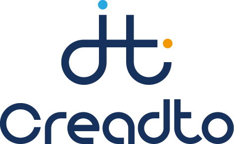

<p align="center">
    <br>
    
    <br>
<p>

# Creadto Library

크리토 라이브러리는 Digital human 그래픽스 처리를 위한 ML 라이브러리입니다. 회사 자체에서 제공되는 API service를 이용하여 서비스를 제공 받을 수 있으며 라이브러리를 직접 다운받아 `./example`에서 기능들을 이용해볼 수 있습니다.
Creadto Library에서 제공하는 서비스는 다음과 같습니다.   

> [!NOTE]
> Pretrained 모델은 MIT license에 적용되지 않으며 [www.creadto.com](www.creadto.com)에서 Pretrained model을 요청할 수 있습니다.

아래는 라이브러리에서 실행가능한 샘플코드 목록입니다.

- [3D Head Reconstruction](./example/head_reconstruction.py)
- [3D Body Reconstruction](./example/body_reconstruction.py)
- [Whole Body Reconstruction](./example/whole_body_reconstruction.py)
- 3D Character Texturing
- [Gender Classification](./example/gender_classification.py)
- [Head Detection](./example/head_detection.py)
- [Body Joint Estimation](./example/joint_estimation.py)
- [Facial Skin Enhancement](./example/skin_enhancement.py)
- [Human Dimension Estimation](./example/human_dimension_esitmation.py)
- [Facial Segmentation](./example/facial_segmentation.py)
- Hair Reconstruction(External)
- Text to Motion Generation(External)
- Image to Speech Generation(External)

## For Developer using Creadto Library

Creadto Library는 [Pytorch](https://pytorch.org/)에 완전한 의존을 하고 있습니다. 배포를 위한 `ONNX`, `TensorRT`, `Triton` 등은 해당 라이브러리에서 제외됩니다. 학습을 도와주는 `Accelerate`, `DeepSpeed` 등도 제외됩니다. 기본적인 Trainer를 제공하고는 있으나 모델과 서비스를 정의하는데목적을 둔 탓에 원 제작자도 모델은 다른 프로젝트에서 학습을 시키고 있습니다.

### ARCHITECTURE

크리토 라이브러리는 인공지능 모델을 서비스에 가깝게 관리합니다. 또한 인공지능 모델의 세분화된 일반적 정의에서 네트워크는 제외됐고 서비스가 붙어있습니다.

* 일반적 정의: **Layers** $\in$ **Blocks** $\in$ **Networks** $\in$ **Models**
* 크리토 라이브러리 정의: **Layers** $\in$ **Blocks** $\in$ **Models** $\in$ **Services**

계층적인 관계를 통하고 있으나 호출의 용이성을 위하여 각 models, services는 독립으로 구성됩니다.   
layers, blocks에서 services를 호출할 수 없도록 models 하위에 속합니다.
```
creadto:
  ├── models
      └── blocks
          └── layers
  ├── services
  .
```

`Pytorch`에 대한 완전한 의존으로 Models와 Services를 `Pytorch`에서 조합하여 만들 수 있습니다. 그러나 개발자 기준으로 Creadto Library는 종속성을 맞춰 모델을 정의하고 개발하는 목적이 있으니, 불필요한 Requirements를 없애고 도커 이미지를 최대한 적게 소유하여 운영할 수 있도록 합니다.   

### ALL SERVICES ARE IMPLEMENTED AS SINGLETON

모든 서비스는 단일 컴퓨터 내에서 존재하는 컨테이너 혹은 Pod을 고려하여 싱글톤으로 구성되어 있습니다. 그 이유는 ML 모델들은 기본적으로 Instantiate가 Call time보다 길기 때문입니다. 그러므로 공유된 메모리에서 Singleton instances를 공유하도록 전역 관리하는 Pool이 있습니다.   
> [!NOTE] 
> 반드시 `__call__` 혹은 `forward` 메소드에는 지역변수에 대해 할당, 수정만 이뤄지도록 해야합니다.

```python
def __call__(self, images):
  crop_images = self.detector(images)       
  result = self.classifier(crop_images)
  return result
```

